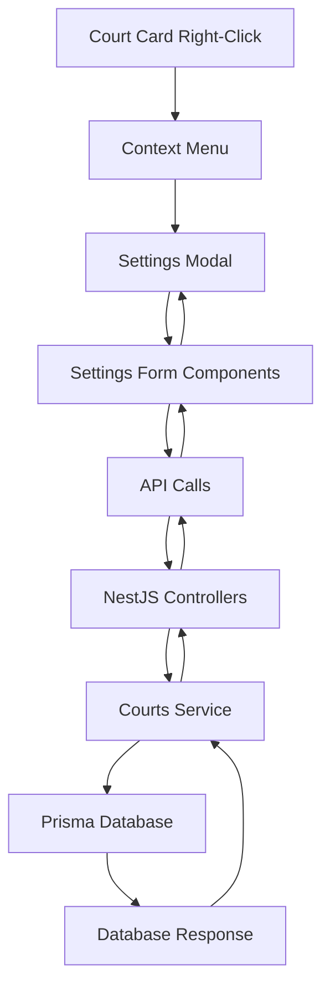

# Design Document

## Overview

The Court Settings Management feature provides a comprehensive interface for configuring court-specific settings including advanced booking limits, unavailabilities, and peak pricing schedules. The feature integrates seamlessly with the existing NestJS backend and Next.js frontend, utilizing the established patterns and UI components.

The system leverages the existing Prisma schema models (`CourtUnavailability` and `PeakSchedule`) and extends the `Court` model's `advancedBookingLimit` field. The interface is accessed through a right-click context menu on court cards, maintaining consistency with modern desktop application patterns.

## Architecture

### Backend Architecture

The backend follows the existing NestJS modular architecture with the following components:

- **Courts Module**: Extended with new endpoints for settings management
- **DTOs**: New data transfer objects for settings operations
- **Services**: Enhanced courts service with settings-specific methods
- **Database**: Utilizes existing Prisma models with proper relationships

### Frontend Architecture

The frontend maintains the existing Next.js structure with:

- **Context Menu**: New right-click functionality on court cards
- **Settings Modal**: Comprehensive settings interface using existing UI components
- **API Integration**: Extended court API client for settings operations
- **State Management**: React state for settings data with optimistic updates

### Data Flow



## Components and Interfaces

### Backend Components

#### 1. Enhanced Courts Controller

New endpoints added to the existing `CourtsController`:

```typescript
// New endpoints
@Get(':id/settings')
getCourtSettings(@Param('id') id: string)

@Patch(':id/advanced-booking-limit')
updateAdvancedBookingLimit(@Param('id') id: string, @Body() dto: UpdateAdvancedBookingLimitDto)

@Get(':id/unavailabilities')
getCourtUnavailabilities(@Param('id') id: string)

@Post(':id/unavailabilities')
createCourtUnavailability(@Param('id') id: string, @Body() dto: CreateCourtUnavailabilityDto)

@Patch(':id/unavailabilities/:unavailabilityId')
updateCourtUnavailability(@Param('id') id: string, @Param('unavailabilityId') unavailabilityId: string, @Body() dto: UpdateCourtUnavailabilityDto)

@Delete(':id/unavailabilities/:unavailabilityId')
deleteCourtUnavailability(@Param('id') id: string, @Param('unavailabilityId') unavailabilityId: string)

@Get(':id/peak-schedules')
getCourtPeakSchedules(@Param('id') id: string)

@Post(':id/peak-schedules')
createCourtPeakSchedule(@Param('id') id: string, @Body() dto: CreateCourtPeakScheduleDto)

@Patch(':id/peak-schedules/:scheduleId')
updateCourtPeakSchedule(@Param('id') id: string, @Param('scheduleId') scheduleId: string, @Body() dto: UpdateCourtPeakScheduleDto)

@Delete(':id/peak-schedules/:scheduleId')
deleteCourtPeakSchedule(@Param('id') id: string, @Param('scheduleId') scheduleId: string)
```

#### 2. New DTOs

```typescript
// Update Advanced Booking Limit DTO
export class UpdateAdvancedBookingLimitDto {
  @IsNumber()
  @Min(1)
  @Max(365)
  advancedBookingLimit: number;
}

// Court Unavailability DTOs
export class CreateCourtUnavailabilityDto {
  @IsDateString()
  date: string;
  
  @IsOptional()
  @IsString()
  startTime?: string;
  
  @IsOptional()
  @IsString()
  endTime?: string;
  
  @IsString()
  reason: string;
  
  @IsBoolean()
  @IsOptional()
  isRecurring?: boolean;
}

export class UpdateCourtUnavailabilityDto extends PartialType(CreateCourtUnavailabilityDto) {}

// Peak Schedule DTOs
export class CreateCourtPeakScheduleDto {
  @IsNumber()
  @Min(0)
  @Max(6)
  dayOfWeek: number;
  
  @IsString()
  startTime: string;
  
  @IsString()
  endTime: string;
  
  @IsNumber()
  @Min(0)
  price: number;
}

export class UpdateCourtPeakScheduleDto extends PartialType(CreateCourtPeakScheduleDto) {}
```

#### 3. Enhanced Courts Service

New methods added to the existing `CourtsService`:

```typescript
// Settings retrieval
async getCourtSettings(courtId: string)

// Advanced booking limit
async updateAdvancedBookingLimit(courtId: string, limit: number)

// Unavailabilities management
async getCourtUnavailabilities(courtId: string)
async createCourtUnavailability(courtId: string, data: CreateCourtUnavailabilityDto)
async updateCourtUnavailability(courtId: string, unavailabilityId: string, data: UpdateCourtUnavailabilityDto)
async deleteCourtUnavailability(courtId: string, unavailabilityId: string)

// Peak schedules management
async getCourtPeakSchedules(courtId: string)
async createCourtPeakSchedule(courtId: string, data: CreateCourtPeakScheduleDto)
async updateCourtPeakSchedule(courtId: string, scheduleId: string, data: UpdateCourtPeakScheduleDto)
async deleteCourtPeakSchedule(courtId: string, scheduleId: string)

// Validation helpers
private validateTimeOverlap(schedules: PeakSchedule[], newSchedule: CreateCourtPeakScheduleDto, excludeId?: string)
private validateUnavailabilityConflicts(unavailabilities: CourtUnavailability[], newUnavailability: CreateCourtUnavailabilityDto)
```

### Frontend Components

#### 1. Enhanced Courts Content Component

The existing `CourtsContent` component will be enhanced with:

- Right-click context menu functionality
- Settings modal integration
- State management for settings data

#### 2. New Court Settings Modal Component

```typescript
interface CourtSettingsModalProps {
  isOpen: boolean;
  onClose: () => void;
  court: Court | null;
  onSettingsUpdate: (courtId: string, settings: CourtSettings) => void;
}

interface CourtSettings {
  advancedBookingLimit: number;
  unavailabilities: CourtUnavailability[];
  peakSchedules: PeakSchedule[];
}
```

#### 3. Settings Sub-Components

- **AdvancedBookingLimitSection**: Input field with validation
- **UnavailabilitiesSection**: List view with add/edit/delete functionality
- **PeakSchedulesSection**: Day-organized view with time slot management
- **UnavailabilityForm**: Modal form for creating/editing unavailabilities
- **PeakScheduleForm**: Modal form for creating/editing peak schedules

#### 4. Context Menu Component

```typescript
interface CourtContextMenuProps {
  court: Court;
  onSettingsClick: (court: Court) => void;
  onEditClick: (court: Court) => void;
  onScheduleClick: (court: Court) => void;
  onToggleStatus: (courtId: string) => void;
  onDelete: (courtId: string) => void;
}
```

### API Integration

#### Enhanced Court API Client

```typescript
// Settings endpoints
export const getCourtSettings = (courtId: string): Promise<CourtSettings>
export const updateAdvancedBookingLimit = (courtId: string, limit: number): Promise<void>

// Unavailabilities
export const getCourtUnavailabilities = (courtId: string): Promise<CourtUnavailability[]>
export const createCourtUnavailability = (courtId: string, data: CreateCourtUnavailabilityDto): Promise<CourtUnavailability>
export const updateCourtUnavailability = (courtId: string, unavailabilityId: string, data: UpdateCourtUnavailabilityDto): Promise<CourtUnavailability>
export const deleteCourtUnavailability = (courtId: string, unavailabilityId: string): Promise<void>

// Peak schedules
export const getCourtPeakSchedules = (courtId: string): Promise<PeakSchedule[]>
export const createCourtPeakSchedule = (courtId: string, data: CreateCourtPeakScheduleDto): Promise<PeakSchedule>
export const updateCourtPeakSchedule = (courtId: string, scheduleId: string, data: UpdateCourtPeakScheduleDto): Promise<PeakSchedule>
export const deleteCourtPeakSchedule = (courtId: string, scheduleId: string): Promise<void>
```

## Data Models

### Existing Models (Already in Schema)

The following models are already defined in the Prisma schema and will be utilized:

```prisma
model Court {
  id                   String   @id @default(uuid())
  name                 String
  type                 String
  description          String?
  pricePerHour         Float
  isActive             Boolean  @default(true)
  imageUrl             String?
  advancedBookingLimit Int      @default(30) // Enhanced usage
  createdAt            DateTime @default(now())
  updatedAt            DateTime @updatedAt

  unavailability CourtUnavailability[]
  peakSchedules  PeakSchedule[]
  // ... other relations
}

model CourtUnavailability {
  id          String   @id @default(uuid())
  courtId     String
  date        DateTime
  startTime   String?
  endTime     String?
  reason      String
  isRecurring Boolean  @default(false)
  
  court       Court    @relation(fields: [courtId], references: [id], onDelete: Cascade)
}

model PeakSchedule {
  id        String @id @default(uuid())
  courtId   String
  dayOfWeek Int
  startTime String
  endTime   String
  price     Int
  
  court     Court  @relation(fields: [courtId], references: [id], onDelete: Cascade)
}
```

### Frontend Type Definitions

```typescript
interface CourtSettings {
  advancedBookingLimit: number;
  unavailabilities: CourtUnavailability[];
  peakSchedules: PeakSchedule[];
}

interface CourtUnavailability {
  id: string;
  courtId: string;
  date: string;
  startTime?: string;
  endTime?: string;
  reason: string;
  isRecurring: boolean;
}

interface PeakSchedule {
  id: string;
  courtId: string;
  dayOfWeek: number;
  startTime: string;
  endTime: string;
  price: number;
}

interface CreateCourtUnavailabilityDto {
  date: string;
  startTime?: string;
  endTime?: string;
  reason: string;
  isRecurring?: boolean;
}

interface CreateCourtPeakScheduleDto {
  dayOfWeek: number;
  startTime: string;
  endTime: string;
  price: number;
}
```

## Error Handling

### Backend Error Handling

- **Validation Errors**: Use class-validator decorators with custom error messages
- **Business Logic Errors**: Custom exceptions for overlapping schedules, invalid time ranges
- **Database Errors**: Proper error handling for constraint violations and foreign key issues
- **Not Found Errors**: Appropriate 404 responses for non-existent courts or settings

### Frontend Error Handling

- **API Errors**: Toast notifications for failed operations
- **Validation Errors**: Inline form validation with error messages
- **Network Errors**: Retry mechanisms and offline state handling
- **Optimistic Updates**: Rollback mechanisms for failed operations

### Error Types

```typescript
// Backend custom exceptions
export class OverlappingScheduleException extends BadRequestException
export class InvalidTimeRangeException extends BadRequestException
export class CourtNotFoundException extends NotFoundException

// Frontend error handling
interface ApiError {
  message: string;
  statusCode: number;
  error?: string;
}

interface ValidationError {
  field: string;
  message: string;
}
```

## Testing Strategy

### Backend Testing

#### Unit Tests
- **Service Methods**: Test all CRUD operations for settings
- **Validation Logic**: Test time overlap detection and validation rules
- **Error Scenarios**: Test error handling for invalid inputs
- **Business Logic**: Test booking limit enforcement and peak pricing calculations

#### Integration Tests
- **API Endpoints**: Test all new endpoints with various scenarios
- **Database Operations**: Test Prisma operations with real database
- **Authentication**: Test JWT guard protection on endpoints

#### Test Structure
```typescript
describe('CourtsService - Settings', () => {
  describe('updateAdvancedBookingLimit', () => {
    it('should update booking limit successfully')
    it('should throw error for invalid limit')
  })
  
  describe('createCourtUnavailability', () => {
    it('should create unavailability successfully')
    it('should handle recurring unavailabilities')
    it('should validate time conflicts')
  })
  
  describe('createCourtPeakSchedule', () => {
    it('should create peak schedule successfully')
    it('should prevent overlapping schedules')
    it('should validate time format')
  })
})
```

### Frontend Testing

#### Component Tests
- **Settings Modal**: Test modal opening, form submission, and data display
- **Context Menu**: Test right-click functionality and menu options
- **Form Components**: Test validation, submission, and error handling
- **List Components**: Test CRUD operations and data display

#### Integration Tests
- **API Integration**: Test API calls and response handling
- **User Interactions**: Test complete user workflows
- **Error Scenarios**: Test error handling and user feedback

#### Test Structure
```typescript
describe('CourtSettingsModal', () => {
  it('should display current settings when opened')
  it('should update advanced booking limit')
  it('should create new unavailability')
  it('should edit existing peak schedule')
  it('should handle API errors gracefully')
})
```

### End-to-End Testing

- **Complete Workflows**: Test full user journey from court selection to settings update
- **Cross-Browser Testing**: Ensure compatibility across different browsers
- **Mobile Responsiveness**: Test settings interface on mobile devices
- **Performance Testing**: Test with large datasets of unavailabilities and peak schedules

## Security Considerations

### Authentication & Authorization
- All settings endpoints protected by JWT authentication
- Role-based access control for court management operations
- Validation of court ownership/access permissions

### Input Validation
- Comprehensive validation of all input data
- SQL injection prevention through Prisma ORM
- XSS prevention through proper data sanitization

### Data Integrity
- Database constraints to prevent invalid data
- Transaction handling for complex operations
- Proper error handling to prevent data corruption

## Performance Considerations

### Backend Optimization
- Database indexing on frequently queried fields
- Efficient queries with proper Prisma includes
- Caching strategies for frequently accessed settings
- Pagination for large datasets

### Frontend Optimization
- Lazy loading of settings data
- Optimistic updates for better user experience
- Debounced API calls for form inputs
- Efficient re-rendering with React optimization techniques

### Database Optimization
```sql
-- Recommended indexes
CREATE INDEX idx_court_unavailability_court_date ON court_unavailability(courtId, date);
CREATE INDEX idx_peak_schedule_court_day ON peak_schedule(courtId, dayOfWeek);
CREATE INDEX idx_court_unavailability_recurring ON court_unavailability(isRecurring, date);
```